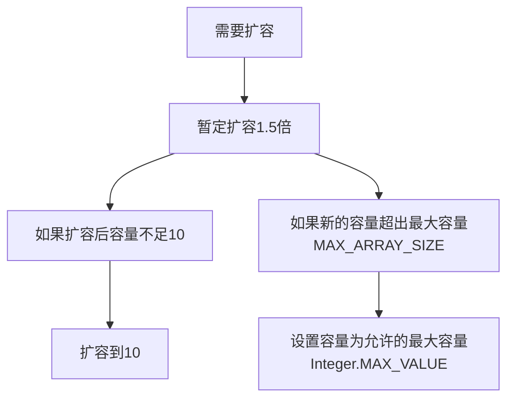

# Java集合类源码分析--ArrayList

> 核心就在于ArrayList的自动扩容了

## 1、数据结构

Arraylist底层数据结构为数组

```java
    transient Object[] elementData; // non-private to simplify nested class access
```

Java语言的关键字，变量修饰符，如果用**transient**声明一个实例变量，当对象存储时，它的值不需要维持。换句话来说就是，用**transient**关键字标记的成员变量不参与序列化过程。

<!--more-->

## 2、继承结构


可以看出Arraylist继承自AbstractList接口，并实现了List<E>, RandomAccess, Cloneable, java.io.Serializable接口


## 3、类中的属性

```java
public class ArrayList<E> extends AbstractList<E>
        implements List<E>, RandomAccess, Cloneable, java.io.Serializable
{
	//序列化id
    private static final long serialVersionUID = 8683452581122892189L;
    
	//初始容量
    private static final int DEFAULT_CAPACITY = 10;

    //预先定义一个空数组，用于构造函数
    private static final Object[] EMPTY_ELEMENTDATA = {};

    /**
     * 用于扩容时检测arraylist的构造方法是ArrayList(int initialCapacity)还是ArrayList()
     */
    private static final Object[] DEFAULTCAPACITY_EMPTY_ELEMENTDATA = {};
    
    //存储数据元素的数组
    transient Object[] elementData; 
    
    //当前arraylist的集合大小，即elementData中元素的个数
    private int size;
```


## 4、构造方法

有三个构造方法

```java
    //构造给定容量大小的arraylist
    public ArrayList(int initialCapacity) {
        if (initialCapacity > 0) {
            this.elementData = new Object[initialCapacity];
        } else if (initialCapacity == 0) {
            this.elementData = EMPTY_ELEMENTDATA;
        } else {
            throw new IllegalArgumentException("Illegal Capacity: "+
                                               initialCapacity);
        }
    }

    //构造一个空的arraylist
    public ArrayList() {
        this.elementData = DEFAULTCAPACITY_EMPTY_ELEMENTDATA;
    }

 	//传入一个Collection类型的参数，并将其转换为Arraylist
    public ArrayList(Collection<? extends E> c) {
        elementData = c.toArray();
        if ((size = elementData.length) != 0) {
            // defend against c.toArray (incorrectly) not returning Object[]
            // (see e.g. https://bugs.openjdk.java.net/browse/JDK-6260652)
            if (elementData.getClass() != Object[].class)
                elementData = Arrays.copyOf(elementData, size, Object[].class);
        } else {
            // replace with empty array.
            this.elementData = EMPTY_ELEMENTDATA;
        }
    }
```

可见

```java
List<Integer> lists = new ArrayList<Integer>();
```

这句代码执行后，实际上lists的容量为0，在第一次调用add方法时，才将lists的容量初始化为10.

## 5、常用方法


### 5.1 add方法

```java
    /**
     * 在特定位置添加新元素，add(E e)中分理出来的辅助方法
     */
    private void add(E e, Object[] elementData, int s) {
        if (s == elementData.length)
            elementData = grow();//扩容
        elementData[s] = e;
        size = s + 1;
    }

    /**
     * 在arraylist尾部添加元素
     */
    public boolean add(E e) {
        modCount++;
        add(e, elementData, size);
        return true;
    }

    /**
     * 在特定位置插入元素
     */
    public void add(int index, E element) {
        //保证插入位置没有越界
        rangeCheckForAdd(index);
        //modCount用于1记录arraylist被改变的次数，用于fail-fast机制
        modCount++;
        final int s;
        Object[] elementData;
        if ((s = size) == (elementData = this.elementData).length)
            elementData = grow();
        //插入元素前要将之后的元素向后移动
        System.arraycopy(elementData, index,
                         elementData, index + 1,
                         s - index);
        elementData[index] = element;
        size = s + 1;
    }
    /**
     * 保证插入位置没有越界
     */
    private void rangeCheckForAdd(int index) {
        if (index > size || index < 0)
            throw new IndexOutOfBoundsException(outOfBoundsMsg(index));
    }
```

扩容核心方法：

```java
	private static final int MAX_ARRAY_SIZE = Integer.MAX_VALUE - 8;    
	/**
     * 扩容以确保容量满足minCapacity要求的容量
     */
    private Object[] grow(int minCapacity) {
        //按照确定好的新容量扩容
        return elementData = Arrays.copyOf(elementData,
                                           newCapacity(minCapacity));
    }

    private Object[] grow() {
        return grow(size + 1);
    }

    /**
     * 返回一个至少为minCapacity的容量
     * Returns the current capacity increased by 50% if that suffices.
     * 除非给定的minCapacity大于MAX_ARRAY_SIZE，否则返回的容量不会大于MAX_ARRAY_SIZE
     */
    private int newCapacity(int minCapacity) {
        // overflow-conscious code
        int oldCapacity = elementData.length;
        //扩容50%
        int newCapacity = oldCapacity + (oldCapacity >> 1);
        //如果elementData就是个空数组，或者扩容1.5倍后还是满足不了要求的容量
        //那么扩容为10
        if (newCapacity - minCapacity <= 0) {
            if (elementData == DEFAULTCAPACITY_EMPTY_ELEMENTDATA)
                return Math.max(DEFAULT_CAPACITY, minCapacity);
            if (minCapacity < 0) // overflow
                throw new OutOfMemoryError();
            return minCapacity;
        }
        //如果扩容后大小大于MAX_ARRAY_SIZE，就取Integer.MAX_VALUE
        return (newCapacity - MAX_ARRAY_SIZE <= 0)
            ? newCapacity
            : hugeCapacity(minCapacity);
    }

    private static int hugeCapacity(int minCapacity) {
        if (minCapacity < 0) // overflow
            throw new OutOfMemoryError();
        return (minCapacity > MAX_ARRAY_SIZE)
            ? Integer.MAX_VALUE
            : MAX_ARRAY_SIZE;
    }
```

总结一下扩容流程如下：



需要注意的是：

- size()方法返回的并不是elementData的大小，而是size的值，size的值只会在每次添加新元素的时候自增。
- arraylist中可以存放null元素

### 5.2 remove、clear等方法

```java
    public E remove(int index) {
        Objects.checkIndex(index, size);
        final Object[] es = elementData;

        @SuppressWarnings("unchecked") E oldValue = (E) es[index];
        fastRemove(es, index);

        return oldValue;
    }
    private void fastRemove(Object[] es, int i) {
        modCount++;
        final int newSize;
        if ((newSize = size - 1) > i)
            System.arraycopy(es, i + 1, es, i, newSize - i);
        es[size = newSize] = null;
    }
```

将要移除的元素后的所有元素向前移动，将最后一个元素赋值为null，让gc(垃圾回收机制)更快的回收它。并且改变size的大小。

```java
    public void clear() {
        modCount++;
        final Object[] es = elementData;
        for (int to = size, i = size = 0; i < to; i++)
            es[i] = null;
    }
```

clear()方法将elementData中所有的元素设为null

### 5.3 get和set

```java
    public E get(int index) {
        Objects.checkIndex(index, size);
        return elementData(index);
    }
    public E set(int index, E element) {
        Objects.checkIndex(index, size);
        E oldValue = elementData(index);
        elementData[index] = element;
        return oldValue;
    }
```

这两个很简单了